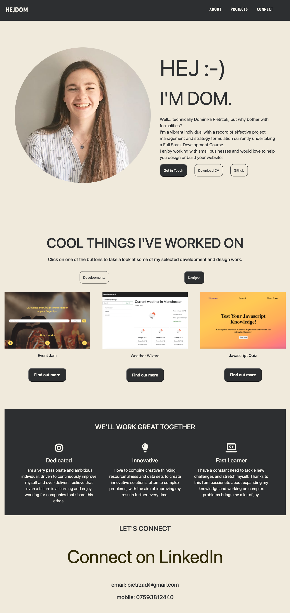
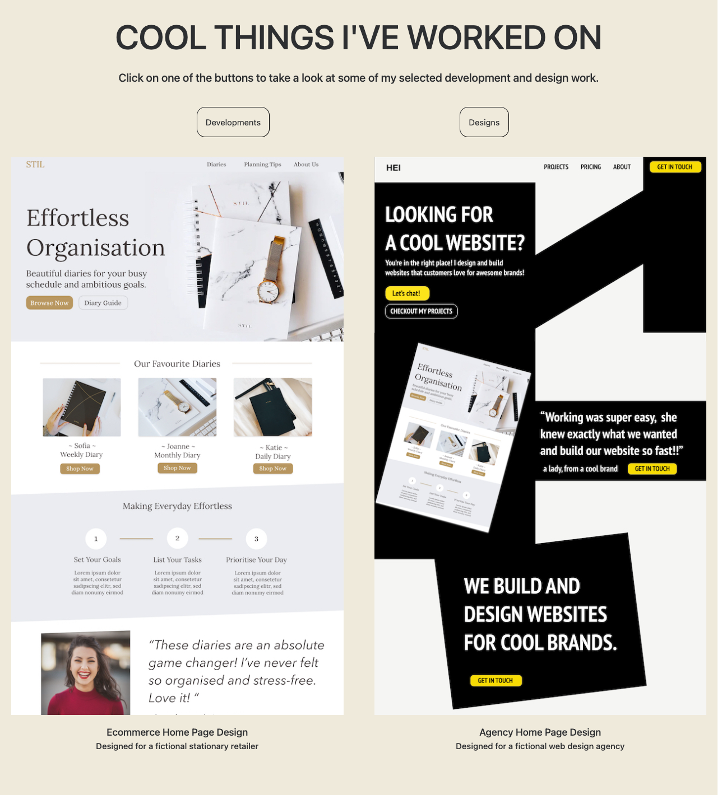

# Personal Portfolio

## Link to Deployed Git Page
https://dominikacookies.github.io/personal_portfolio/

## License
MIT

## Technologies used
HTML5, CSS, Javascript, jQuery, Bootstrap

## Description
This project is a personal portfolio that displays some of the key development projects I have worked on alongside my key skills.

## Key Features
1. The site optimises for different screen sizes through the use of flexbox (USP section) and media queries (in multiple places)
2. The site dynamically renders development or design projects based on the user's selection.
3. If a link in the nav bar is selected, the browser will scroll down to the relevant section
4. When the site loads, the image of the portfolio owner has been animated to ease in from the left
5. The site contains links to Github, deployed applications and my LinkedIn.

## Desktop Screenshots
### Website with the development projects section

  

### Website with the design section only

